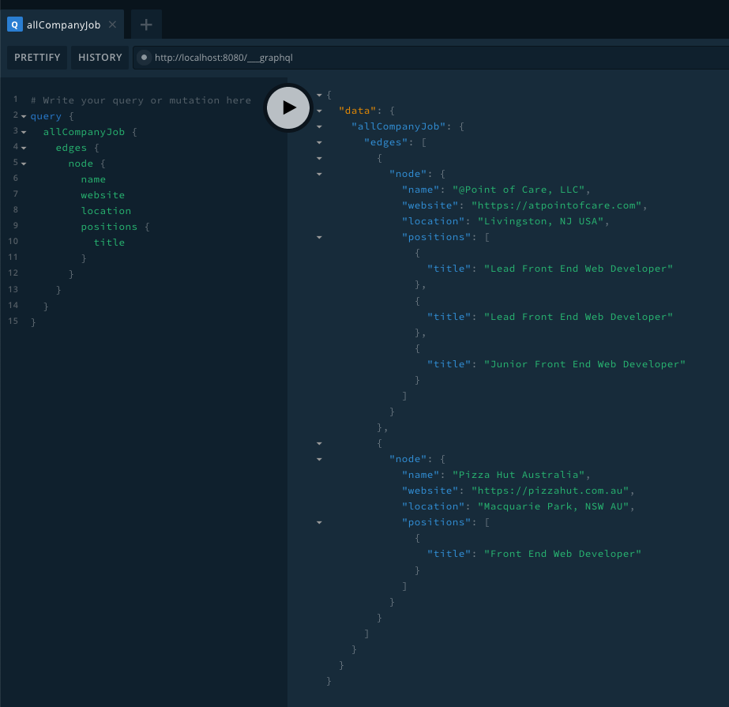
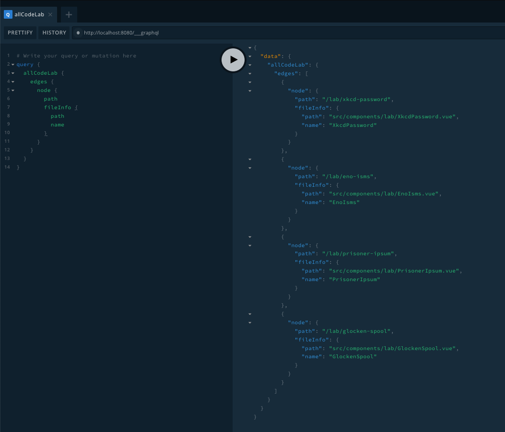

A couple months ago I decided to make some changes to this website. One of those changes involved moving the code base from a [Nuxt](https://nuxtjs.org/) project to [Gridsome](https://gridsome.org/). Gridsome is a powerful tool, with a resolute focus on generating [JAMStack](https://jamstack.org/) sites. The [most](https://scotch.io/tutorials/getting-started-with-gridsome) [common](https://www.danvega.dev/blog/2019/01/31/hello-gridsome/) [use cases](https://medium.com/the-web-tub/building-a-showcase-site-with-gridsome-netlify-977d51432838) [are well](https://alligator.io/vuejs/gridsome-blog/) [documented](https://www.telerik.com/blogs/building-a-blog-with-vue-and-markdown-using-gridsome) [all over the place](https://gridsome.org/docs/), but when I started looking at doing some more interesting data wrangling I hit a road block. If I wanted to leverage Gridsome to do what I wanted to do I had to dig in and go beyond the examples and the tutorials to really understand what this tool was capable of.

---

## Working with Local JSON Data

I'm a big fan of JSON. It might sound silly, but I find the format very intuitive, easy to read, and thanks to modern tooling, even easier to work with in JavaScript. [APIs](https://en.wikipedia.org/wiki/Application_programming_interface) are one of the main tent-poles of the [JAMStack](https://jamstack.org/) (and we'll get to those in a bit), but for some use cases building a REST services is more complexity than is necessary. Wouldn't it be nice if our datasets were just another part of our project's code base that we could manually import and use as necessary? Gridsome does [document how to do this](https://gridsome.org/docs/client-side-data/#fetch-from-local-json-files), but I found that approach only covered the most basic of my use cases. I've got an entire *layer* dedicated to data in my development environment, why not use that?


For sure, small unique chunks of data can be organized as JSON files for my convenience. The raw data can be just raw data, and I can import it into my components _as needed_. This solution works just fine for a lot of things...

```js
import { ref } from '@vue/composition-api'
import addressdata from '@/data/address.data.json'
import educationdata from '@/data/education.data.json'
import sociallinks from '@/data/social-links.data.json'
import statementdata from '@/data/statement.data.json'

export function usepersonaldata () {
  const address = ref(addressdata)
  const education = ref(educationdata)
  const statement = ref(statementdata)
  const links = ref(sociallinks)
  const name = ref('tonio hubilla')

  return {
    name,
    address,
    education,
    links,
    statement
  }
}
```

But what happens when I start working with data "types", that follow a specified format, over multiple instances? Do I have to save all my `professional experience` data in one giant JSON dataset instead of breaking it up across multiple smaller ones, or do I have to write a little bit of glue code to create my own larger datasets from smaller ones before I import them into my components? To some extent this is already what the official [filesystem plugin](https://gridsome.org/plugins/@gridsome/source-filesystem) is doing under the hood, but with some caveats...

I [discovered](https://github.com/gridsome/gridsome/issues/401) that the filesystem plugin does support multiple transformers (i.e. [markdown](https://gridsome.org/plugins/@gridsome/transformer-remark), [YAML](https://gridsome.org/plugins/@gridsome/transformer-yaml), [JSON](https://gridsome.org/plugins/@gridsome/transformer-json), etc), but each transformer requires its own plugin instance be listed in the `gridsome.config.js` file.

```js
module.exports = {
  plugins: [{
    use: '@gridsome/source-filesystem',
    options: {
      path: 'src/blog/**/*.md',
      typeName: 'BlogPost',
      route: '/blog/:fileInfo__name',
      remark: {
        externalLinksTarget: '_blank',
        externalLinksRel: ['nofollow', 'noopener', 'noreferrer'],
        plugins: ['@gridsome/remark-prismjs']
      }
    }
  }, {
    use: '@gridsome/source-filesystem',
    options: {
      path: 'src/data/cv/*.json',
      typeName: 'CompanyJob',
      json: {}
    }
  }, {
    use: '@gridsome/source-filesystem',
    options: {
      path: 'src/components/lab/**/*.vue',
      typeName: 'CodeLab',
      route: '/lab/:fileInfo__name'
    }
  }]
}
```

It's a bit counter-intuitive, but it works. Now every JSON file within the `src/data/cv/` directory gets added to the data layer as a `CompanyJob` type for me to query like any other GraphQL node.



> This configuration may change in the future, as it seems the [issue](https://github.com/gridsome/gridsome/issues/401) has been assigned a maintainer.

## Working with Components as Data

You may have noticed the last plugin instance in the above list. I can also use this method to register Vue components as content types without a transformer. In this way we can add project metadata to our GraphQL data layer, making our code more dynamic and flexible as it grows in complexity.



With the above query, I can render [dynamic components](https://vuejs.org/v2/guide/components-dynamic-async.html) with a very little templating logic.

```html
<template>
	<section class="lab">
		<component :is="$page.lab.fileInfo.name"></component>
	</section>
</template>
```

I can even use a plain JavaScript file, housed within a component subdirectory, to create dynamic exports for each of my components.

```js
const requireComponent = require.context('.', false, /\.vue$/)

export default requireComponent.keys().reduce((components, filename) => {
  const key = filename.replace(/\.\//, '').replace(/\.vue$/, '')
  components[key] = requireComponent(filename).default
  return components
}, {})
```

With those two things in place, automatically registering *all components* in that subdirectory becomes trivial with my Gridsome template's script block.

```js
import Components from '@/components/lab'
export default {
  components: {
    ...Components
  }
}
```

Did I mention this happens **auto-f'n-matically** for every Gridsome build as I add components to the subdirectory, and that I only really had to set up all this configuration the one time?


### Working with Remote Data

Documentation on using the Data Store API [is there](https://gridsome.org/docs/data-store-api/), but I had to pour over it several times to put all the disparate pieces together into a cohesive understanding of the feature. Once I had built up that understanding, and started trying to implement, I got caught by a few small things that weren't to me.

### Server Hooks

The `loadSource` and `createPages` methods are **hooks**. That means they get called **once** per build. This happens when you run either `gridsome develop` or `gridsome build`, but _only_ when you run those commands. If you add a new remote data source to your `gridsome.server.js` file, you'll need to rebuild.

This also means that if you are trying to work with multiple remote sources, you only get the **one** lifecycle hook to add it to the data store. So if you have two or three different APIs you are trying to load data from, all three calls have to be registered individually within the one `loadSource` hook.

### Types, Pages, and Routes

Registering `contentType`s using the `loadSource` is great for datasets you want to query within your pages or your components. However, if you want to bind particular data to a route, you will need to use the `createPages` hook instead. Similar to the `loadSource` hook, if you are working with multiple remote sources, all that needs to happen within this method.

```js
api.createManagedPages(async ({ createPage }) => {
	try {
		const token = process.env.STORYBLOK_TOKEN
		const req = await fetch(`https://api.storyblok.com/v1/cdn/stories?token=${token}&cv=${Date.now()}&filter_query[component][in]=page`)
		const res = await req.json()

		for (let story of res.stories) {
		 createPage({
			 path: story.full_slug === 'home' ? story.path : `/${story.full_slug}`,
			 component: './src/templates/Story.vue',
			 context: {
				 id: story.id,
				 name: story.name,
				 content: story.content
			 }
		 })
		}
	} catch (err) {
		console.log('ERROR: Unable to fetch CMS Content')
		console.error(err)
	}
})
```

The above snippet shows an example case pulled from a different project, where I'm requesting data from a CMS. Since Gridsome generates HTML files and subdirectories, most of the concepts I have about working with client-side routing don't hold anymore. Whereas client-side routers typically _affect_ a directory structure with a string, Gridsome is doing the inverse. We're giving each page we create with `createPage` a `path` string, and Gridsome creates actual directories that match that pattern on build. Like Nuxt, Gridsome has some convenience patterns for automatically creating directory structures, but if you want to customize any of that you'll have configure your `gridsome.server.js` file.

---

Gridsome has proven to be a very useful tool for me. The documentation covers most things, but it only hints at the possibilities if you're unfamiliar with similar technologies like Gatsby. If you dig deep and try to explore how to use it for different applications and custom use cases, you'll probably find that it's also very flexible and expressive.

One of the things I love about static site generators is that it allows me to use all of the conveniences and tooling of modern front end workflows, but it also brings all those ideas back to basics. You're no longer working with state management, or routing abstractions. It's just HTML files in directories.

Gridsome strikes a nice balance between abstractions and basics, as long as you're willing to take the time to explore its patterns and capabilities, and apply a little bit of planning and forethought into what you're trying to achieve.
